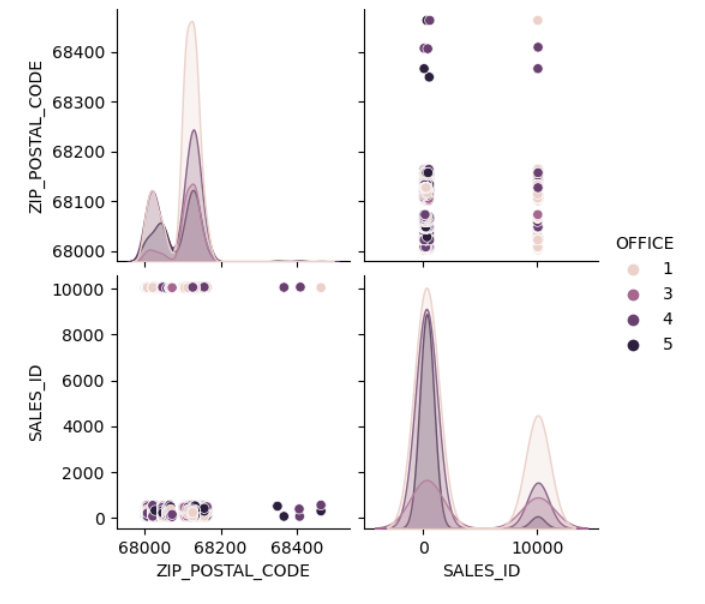
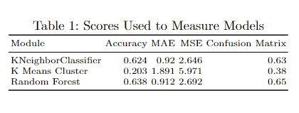

# Eden Anderson
## Data Analytics 44688 / Data Analytics Capstone Project

# General Project Instructions
## 7 Modules 
The seven modules are roughly summarized here. It can be helpful to read the module assignments early, so you know how to plan.

1. Getting Started
    1. Create your GitHub repo,
    1. Create and create and outline your Overleaf report
1. Background and Data Collection - initial data collection, extraction, ingestion, description.
    1. Report: Write up your problem statement clearly and concisely.
    1. Report: Write an introduction to your project.
    1. Report: Provide some background on prior work in this area. Cite all sources - all your references, sources, and resources.
    1. GitHub: Collect your data - gather, scrape, stream in, or otherwise define and extract your data
    1. Report: Describe your data  - like a data scientist - be specific
    1. Report: Cite your sources as you consult them.
    1. Report and GitHub: All external credit must be acknowledged both in GitHub (the README.md - and your report). This is critical. Academic integrity charges should be expected if sources are used improperly or without credit. Giving credit is a key part of analytics and science in general. Give credit - for your data sources, your background information, tools used, and especially any code or related projects consulted. If AI sources are consulted, give credit. This is your project and you must be the author - do not just copy and paste content directly. It's a challenging line, but key to your professional reputation. Use these projects to help you land the work you'd enjoy - show the companies you are respectful of intellectual property rights. 
1. Data Cleaning - start the exploration process and begin assessing your data - what culling and cleaning is needed before processing the useful parts (this is typically 70-80% of the work).
    1. This is mostly done on your machine and pushed/synced to GitHub.
    1. Use the report to explain your data size, attributes, range - what is numeric, what is categorical, what strategies did you use - how much was bad and what strategies so you need to clean it and get the useful parts. 
1. Present Exploratory Analysis - use your tools, explore your data (explain to your readers how you explored and what you needed to do to clean and prepare the data - include charts, tables, initial insights).
    1. Describe and present the work you did in scripts, workbooks, and/or notebooks.
    1. Include key summaries of data - and key code in your report. 
    1. They should be able to read your report without consulting GitHub, but you should link to GitHub to make it easy for readers to explore your code as well.
1. Employ Predictive Modeling - use your clean data to build a machine learning model (e.g. linear regression or others)
1. Present Results - interpret and present your results, predictions, insights, assessments, conclusions. Summarize your work in a concise, useful abstract at the beginning. Describe future work. 
1. Finalize Deliverables - deliverables should be essentially finished after Module 6.
    1. Module 7 is only minor (or no) revisions.
    1. Finalize your GitHub repo and Overleaf report.

# Module 1 Overview: Overleaf & LaTeX

In Module 1, I created an Overleaf account and began the process of understanding how to use LaTex, a reporting software.
* We were given a zip file that contained a template report and a template bibliography.
* I uploaded the zip file and began to modify the template report, renaming it "AndersonCapstoneProject." 
    * Modifying the report included naming my project, adding my name and personal information, and renaming the main outline points to align with my project.
    * I also wrote an introduction using prompts from our class assignment.
* Once I began writing the introduction, I found online articles from reputable websites to use as supporting references.
    * At this point, it became necessary to start modifying the template bibliography.
    * I found an online citation generator that used BibTeX style, so that I could copy the citation directly to my bibliography.
    * I added citations to the report.
* I also found my first image to use in my project report.
    * I found the image online and saved a .png copy to my Overleaf file.
    * I generated a citation for the image and added it to both the image description as well as the text that summarized the image.

# Module 2 Overview: Data Collection

In Module 2, I curated data from a franchised website and began the process of understanding the data that came with the CSV file.
* I had already determined the data source when choosing my project.
    * I verified with the brokers/owners of the company that I could use the information, but that I would need to remove any personal identification information.
* After downloading the CSV file, I reviewed the attributes and records.
    * I removed personal identification information: Realtor name and personal information, client names and personal information, and commission amount.
    * I removed unnecessary information: internal transaction number, Realtor information from other brokerages, dates not related to actual closing, royalty fees, etc.
    * I also identified the type of information that was contained in each attribute (column).
* At that point, I began writing the description of the data in my report on Overleaf.  
    * I described how I attained the information and the fact I was given permission to use this data.
    * I linked the data within the report, so I learned how to create a hyperlink within LaTeX.
    * I identified the major attributes for my project: Company, Postal Code, and Sales ID.
* Finally, I began to describe the data preparation, which will be addressed more thoroughly and finalized in the next module.

# Module 3 Overview: Data Cleaning
In Module 3, I continued to work with the original data to prepare the data set for further analyzing in Python.
* I used the CSV file to determine the quality by evaluating its validity, consistency, accuracy, precision, uniformity, and completeness.
    * I verified that all city names were spelled correctly.
    * I corrected 37 zip codes to remove the extra 4-digit formatting, so that all zip codes had five digits.
    * I looked up one incomplete address on the MLS to add the correct missing information. (This was necessary since a precise zip code was needed.  IF I had been looking to fill an attribute like sales volume, I could have used median or mean values.)
    * I then removed transactions that occurred outside of the Omaha, NE, metropolitan area.
* At this time, I used the cleaned data to create a new CSV file that contained only the cleaned data set.
    * The new data file contained 3140 records.
    * Unnecessary/irrelevant attributes were removed.
    * I reformatted the attribute/column headings by removing spaces and adding underscores, so that they were easier to use in Python.
    * As a result, the new, clean CSV file had 3140 records and 7 attributes.
* The following major data attributes remained in the data set.
    * Office - Home office of a Realtor
    * Property Address - Street name and number of a transaction
    * City - City of a transaction (all within the Omaha, NE, metropolitan area)
    * State - State of a transaction (all Nebraska)
    * Zip/Postal Code - Zip code associated with a transaction
    * Actual Close Date - Closed date verifies occurred in 2022 window
    * Sales ID - Internal number that references specific Realtor of a transaction
* At this point, the independent variable was identified as the Office ID, which will be used to evaluate locations of the transactions.
* The dependent variables were identified as the Zip Code and Sales ID, which each will be compared to the Office ID to determine if there is a correlation.
* The CSV file was then imported into JupyterLab for further data preparation.
    * Python was used to verify that the data was clean.
    * Python was used to verify that there were no null values in the main attributes.
    * Python was used to identify the data type of the dependent and independent variables - all integers.
    * Finally, Python was used to create visualizations that allowed the data distribution to be reviewed.
* At this point, we were able to conclude that the data was indeed quality data that can be used to determine if a correlation exists between an office location and where a transaction occurs.

# Module 4 Overview: Exploratory Data Analysis
In Module 4, I began the data analysis portion of the project by performing the Exploratory Data Analysis (EDA).  EDA is a process to review the data by investigating the data set to summarize and analyze the attributes in order to gain a better understanding of what the data set has to offer.  EDA often involves visualization to demonstrate any patterns and potential relationships between the variables.  Making EDA an important part of the data analytics process allows for the data scientist (or analyst) to find outliers/anomalies, test hypotheses, and to check assumptions.  Statistical summaries and different visualization techniques are used to summarize the data and present it in multiple ways, so the best understanding of the data can be developed.

Exploratory data analysis is essential to all data science and data analytics projects because it allows the scientist/analyst to evaluate the data before assumptions are made.  Identifying errors, outliers, and anomalies allows for the scientist/analyst to gain a better understanding that can help them to form a more focused hypothesis:  By performing EDA, the scientist/analyst can ask better questions, which then leads to a better focus, and thus a probable better outcome for the client.  In essence, performing EDA helps the scientist/analyst to move towards a better model, which will most likely result in a more trustworthy, complete outcome for the client.

* There are four main types of EDA:
    * Univariate non-graphical:  A simple form of data analysis that is comprised of one variable.  Because of this, there are no causal relationships, and the main purpose is to find patterns within the single variable.
    * Univariate graphical: Similar to the univariate non-graphical method, the univariate graphical method deals with just one variable.  The difference, however, comes from the visualization of the patterns.  (Most common: stem-and-leaf plots, histograms, and boxplots)
    * Multivariate non-graphical: A form of analysis that shows a relationship between 2+ variables. This analysis typically occurs through cross-tabulation or statistics. 
    * Multivariate graphical: Like the univariate graphical analysis, the multivariate graphical analysis uses visualization to display relationships between the 2+ variables.  (Most common: grouped bar plot, bar chart; other common: scatter plot, heat map, bubble chart)
* For my project, I found using the graphical methods to be more useful.  I first used histograms and boxplots to determine patterns and look for outliers.  I then used a scatterplot and heat map to analyze possible  correlations.

I followed these steps/techniques to perform the EDA on my data set. 
1. After cleaning the data, I imported the CSV file into a JupyterLab notebook, where I had already imported the necessary Python modules (numpy, pandas, matplotlib, and seaborn).
1. The first thing I did in my notebook was check the data to verify that the columns imported matched my CSV file using the command data.columns.
1. I then previewed the data to make sure it was displaying correctly using the command data.describe.
Next, I verified that there were not any null values in my data by running the command data.isnull().any().
1. I then verified that all the main attributes of my data were numerical by running the command data.OFFICE.head() (or ZIP_POSTAL_CODE and SALES_ID), which returned that it was dtype: int64.
1. I next ran a command to visualize the OFFICE data in a boxplot with data.boxplot('OFFICE'), which showed that the there were no outliers.
1. I generated histograms for both the ZIP_POSTAL_CODE and SALES_ID attributes to analyze the distribution of data by running the command data.hist().
1. I looked at the statistical information by running the command data.describe().
1. After that, I began to explore multivariate visuals to look for patterns and causal relationships by generating a heatmap (sns.heatmap()) and a scatterplot (sns.relplot()).

During this phase, there were a a couple insights that could be drawn from this process.
* The biggest insight that I am learning is that there might not be the correlation I was looking for (office locations affecting transaction locations).  There is a slight correlation between SALES_ID and ZIP_POSTAL_CODE, which could prove to be valuable information for my brokers.
* In addition, I am starting to better understand which visualizations help me understand the data more comprehensively:  For example, I appreciated the heatmap showing correlation, and while I found the boxplot of the OFFICE_ID variable to be helpful, it did not generate further understanding.  Similarly, using scatterplots may not be a helpful tool, since the SALES_ID attribute is not evenly distributed numerically.

# Module 5 Overview: Predictive Analysis
In Module 5, I continued the data analysis process by moving into the Predictive Analysis phase of my project.  Predictive analysis is the process of using the data set within a Machine Learning (ML) Pipeline by using an ML algorithm to generate a model that can be used to help make predictions for business decisions. An ML pipeline has 5 steps, and I have already completed the first 3: Data Collection (Module 2), Data Cleaning (Module 3), and Feature Extraction (Module 4).  In this module, I completed the fourth step, Model Validation, and I will complete the fifth step, Visualization, as a part of the next module.

Model validation is the process of using a data set to train and test a Machine Learning algorithm with the ultimate goal of creating a model that can be used to help guide business decisions.  (An ML algorithm is computer code that adapts to data by recognizing patterns and learning from them to produce a model.)  Before I could proceed, I had to determine which ML algorithms could work with my data set.  To do this, I used the following visualization:

This visualization shows that the relationship between the variables is not linear, so it helped me rule out using any Linear Regression models.  I concluded that using a Classification model would be most appropriate for my data set.

I tested 3 different Machine Learning algorithms using Python in a JupyterLab Notebook.  I chose to use the Classification ML algorithms K Number Neighbors (KNN), K Means Clustering, and Random Forest. You can find the full code here: [Anderson_Capstone JupyterLab Notebook](https://github.com/eden0214/44688_CapstoneProject/blob/main/Anderson_Capstone.ipynb). 

In order to prepare the data to be used in the ML Algorithm in Python, I first had to split the data into training and testing sets.  To prepare for this step, I defined the X and y variables, which allowed me to generate  training and testing variables. After defining the variables, I used the sklearn module train_test_plit to create the X_train, y_train, X_test, and y_test variables.

For each of the modules, I completed the following steps.
1. I imported the sklearn module.  
    1. KNeighborsClassifier for K Number Neighbors
    1. KMeans for K Means Cluster
    1. RandomForestClassifier for Random Forest
1. I ran the training data variables through the model.
    1. For the KNN model, I experimented with the number of neighbors by testing the n_neighbors variable with constants 2 through 12 to see which produced the best results (measured in the next step).
    1. For the K Means, I experimented with the number of clusters by testing the n_clusters variable with constants 2 through 12 to see which produced the best results (measured in the next step).
1. I tested the accuracy of each model by importing the sklearn accuracy_score module to evaluate the accuracy of the model using the test data.
1. I then used three additional measurements of success (error) to test each model.
    1. Mean Absolute Error (MAE)
    1. Mean Squared Error (MSE)
    1. Confusion Matrix
1. I compared the results of all the measurements side-by-side by creating a table.

# Module 6 Overview: Interpretation of Results

# Module 6 Overview: Final Project Report
